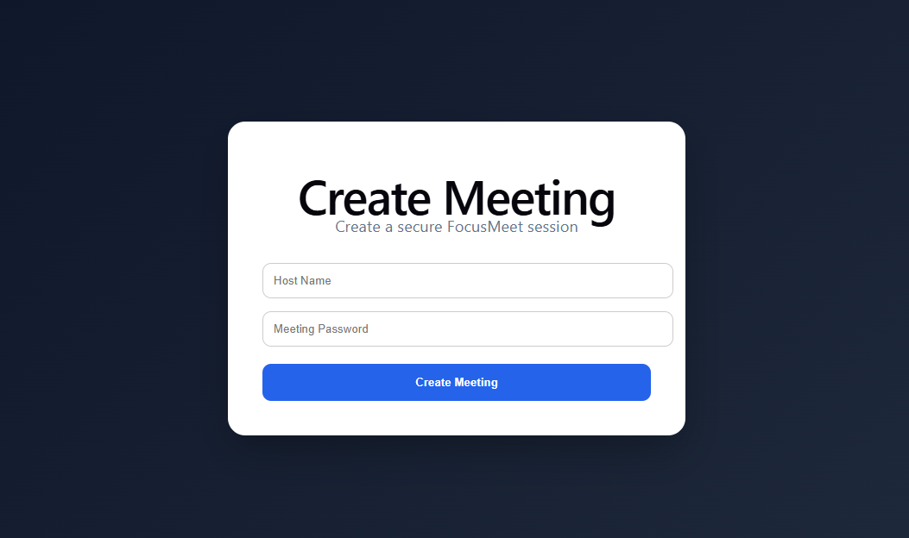
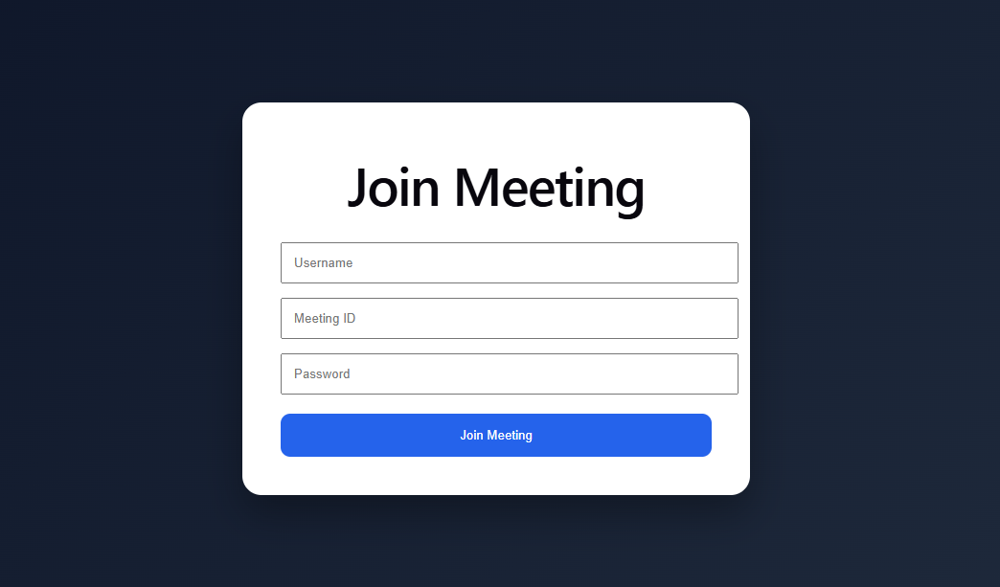
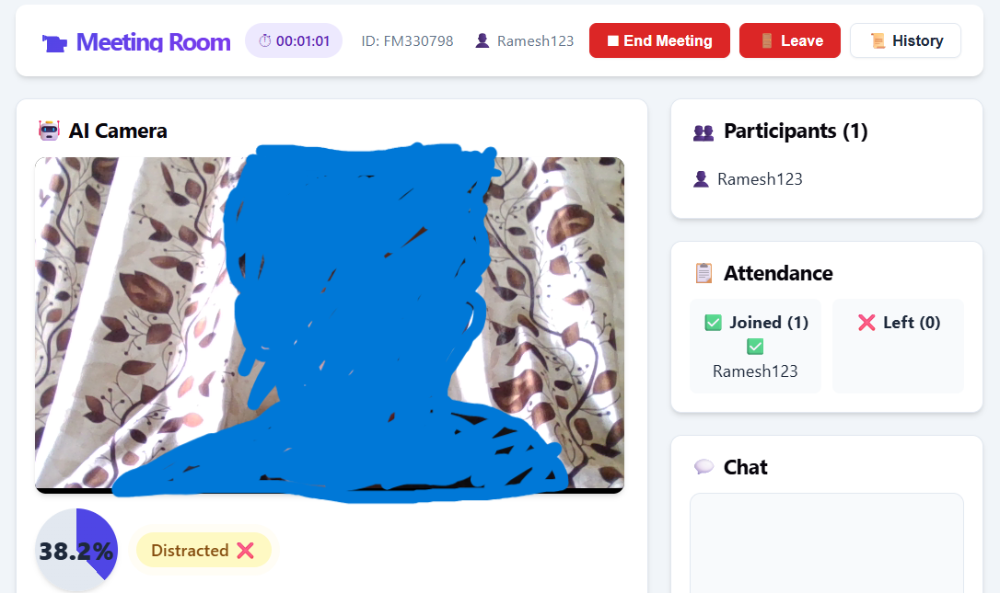
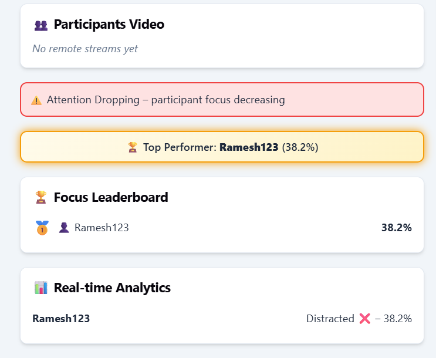
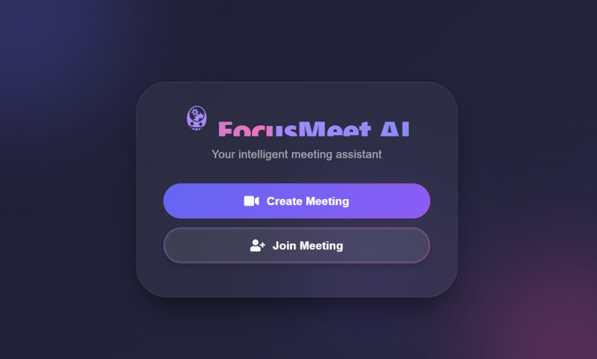
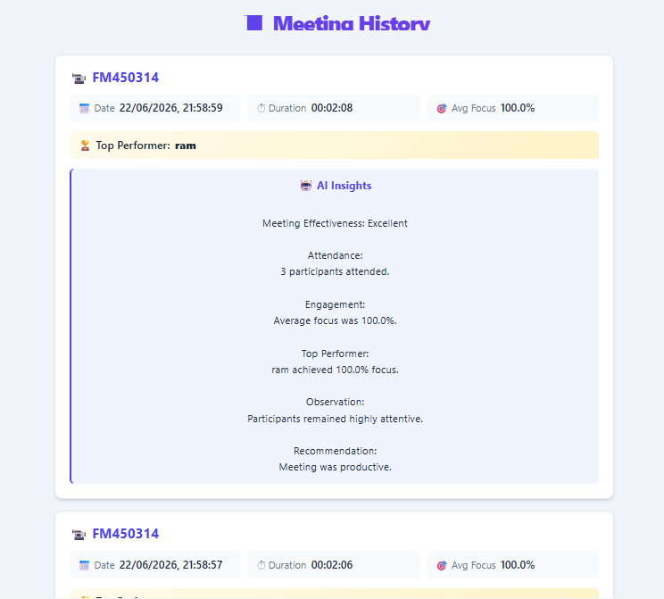
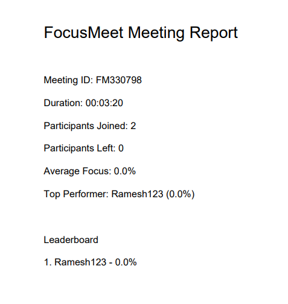

# 🚀 FocusMeet – AI-Powered Meeting Intelligence Platform

## Overview

FocusMeet is an AI-powered video conferencing platform that combines real-time communication with intelligent meeting analytics.

The platform enables users to create secure meetings, join using meeting credentials, communicate through video calls and chat, track participant engagement using AI-based focus detection, generate meeting insights, and download professional meeting reports.

---

## Features

### 🎥 Video Conferencing

* Create and join meetings
* Password-protected meeting rooms
* Real-time WebRTC communication
* Multi-user support

### 💬 Real-Time Chat

* In-meeting messaging
* Instant participant communication

### 🧠 AI Focus Detection

* Face detection and tracking
* Focus score calculation
* Engagement monitoring
* Top performer identification

### 📊 Analytics Dashboard

* Live participant analytics
* Focus leaderboard
* Attendance tracking
* Meeting engagement insights

### 🤖 AI Meeting Insights

* AI-generated meeting summaries
* Engagement analysis
* Productivity recommendations
* Meeting effectiveness evaluation

### 📄 PDF Report Generation

* Meeting duration
* Attendance statistics
* Focus analytics
* Leaderboard rankings
* AI-generated insights

### 📜 Meeting History Dashboard

* View previous meetings
* Store meeting summaries
* Track meeting performance over time

---
## 📸 Application Screenshots

### Create Meeting

### Join Meeting

### Meeting Room

### Real-Time Analytics

### Dashboard

### AI Meeting Insights

### Meeting History

### PDF Report Generation

## Tech Stack

### Frontend

* React.js
* JavaScript
* HTML5
* CSS3

### Backend

* Node.js
* Express.js
* Socket.IO

### Communication

* WebRTC
* Simple Peer

### AI & Analytics

* Face API.js
* MediaPipe Face Mesh
* Groq AI API

### Reporting

* jsPDF

---

## Project Highlights

* AI-powered focus detection
* Real-time meeting analytics
* Automated AI insights
* PDF report generation
* Meeting history tracking
* Modern responsive interface

---

## Future Enhancements

* Meeting recording
* Speech-to-text transcription
* Action item extraction
* Calendar integration
* Cloud database support
* Email report delivery

---

## Developer

Developed as a full-stack AI-powered meeting intelligence platform using React, Node.js, WebRTC, Socket.IO, Computer Vision, and Generative AI technologies.
